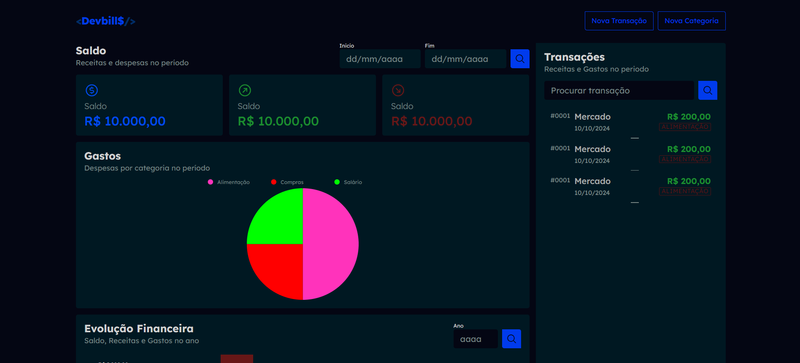
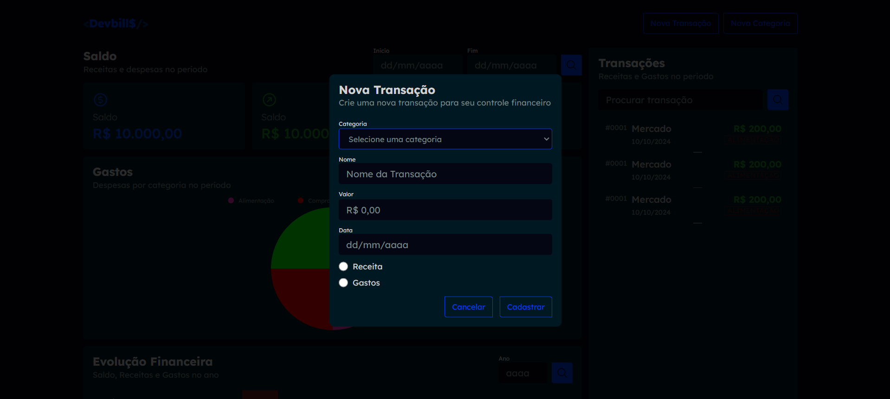
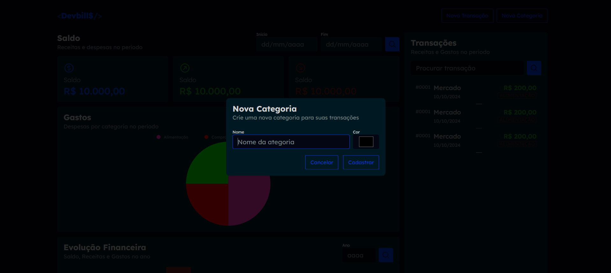

<h1 align="center">Front-End CodeBurguer</h1>

<h2>Olá sejam bem-vindo</h2>

💵 Finalizando o front-end do projeto financeiro!

Com muita dedicação e aprendizado, consegui finalizar a parte de front-end do meu projeto financeiro!

O desenvolvimento foi enriquecedor, principalmente por ter contado com o suporte do curso Dev Club. As aulas e a comunidade me proporcionaram conhecimento sólido e me guiaram para superar os desafios.

<h4>Tecnologias:</h4>
<ul>
<li>⚙ React: Framework JavaScript para interfaces de usuário interativas e responsivas.</li>
<li>🔧 API: Criei uma API para comunicação entre o frontend e o backend.</li>
</ul>

No momento, estou finalizando a integração com a API que criei para o projeto e realizando alguns ajustes finais. 

<h4>Link:</h4>

> Repoditório: https://github.com/DalioSY/front-end-devbills

> Linkedin: https://www.linkedin.com/in/dalio-s-yamada/

#hamburgueria #HTML #CSS #JavaScript #Github #React.js #Typescript #Node.js #Api #Express #Sequelize #Postgresql #Docker #FrontEnd #BackEnd #FullStack #Programador #Dev #Web #Desenvolvedor-Web #DesenvolvedorFrontEnd #DesenvolvedorBackEnd #DesenvolvedorFullStack #TransiçãoDeCarreira #jornadaproficional #aprendendo #tecnologia #openToWork #Recruiter #rh

 

  <ul align="center">
    <h2 style="display: inline-block">Imagens:</h2>
  </ul>

 
  
  
  
 

